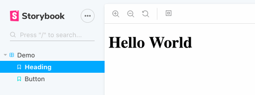

# Storybook Paddings Addon

[](https://www.npmjs.com/package/storybook-addon-paddings)
[](https://github.com/rbardini/storybook-addon-paddings/actions)
[](https://libraries.io/npm/storybook-addon-paddings)

🔲 A [Storybook](https://storybook.js.org) addon to add different paddings to your preview. Useful for checking how components behave when surrounded with white space.



[View demo →](https://storybook-addon-paddings.js.org)

## Installation

```sh
npm install --save-dev storybook-addon-paddings
```

within [`.storybook/main.js`](https://storybook.js.org/docs/react/configure/overview#configure-your-storybook-project):

```js
module.exports = {
  addons: ['storybook-addon-paddings'],
};
```

See [`example`](example) for a minimal working setup.

## Configuration

The paddings toolbar comes with small, medium and large options by default, but you can configure your own set of paddings via the `paddings` [parameter](https://storybook.js.org/docs/react/writing-stories/parameters).

To configure for all stories, set the `paddings` parameter in [`.storybook/preview.js`](https://storybook.js.org/docs/react/configure/overview#configure-story-rendering):

```js
export const parameters = {
  paddings: {
    values: [
      { name: 'Small', value: '16px' },
      { name: 'Medium', value: '32px' },
      { name: 'Large', value: '64px' },
    ],
    default: 'Medium',
  },
};
```

You can also configure on per-story or per-component basis using [parameter inheritance](https://storybook.js.org/docs/react/writing-stories/parameters#component-parameters):

```js
// Button.stories.js

// Set padding options for all Button stories
export default {
  title: 'Button',
  parameters: {
    paddings: {
      values: [
        { name: 'Small', value: '16px' },
        { name: 'Medium', value: '32px' },
        { name: 'Large', value: '64px' },
      ],
      default: 'Large',
    },
  },
};

// Disable addon in Button/Large story only
export const Large = Template.bind({});
Large.parameters = {
  paddings: { disable: true },
};
```
