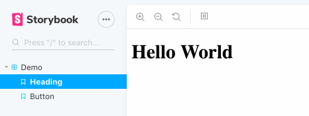

# Storybook Paddings Addon

[](https://www.npmjs.com/package/storybook-addon-paddings)
[](https://github.com/rbardini/storybook-addon-paddings/actions)
[](https://libraries.io/npm/storybook-addon-paddings)

🔲 A [Storybook](https://storybook.js.org) addon to add different paddings to your preview. Useful for checking how components behave when surrounded with white space.



[View demo →](https://storybook-addon-paddings.rbrd.in)

## Installation

```sh
npm install --save-dev storybook-addon-paddings
```

Register the addon in `.storybook/main.ts`:

```ts
// .storybook/main.ts

// Replace your-framework with the framework you are using (e.g., react-vite, nextjs-vite)
import { defineMain } from '@storybook/your-framework/node'

export default defineMain({
  // ...rest of config
  addons: ['storybook-addon-paddings'],
})
```

Register the addon's preview annotations in `.storybook/preview.ts`:

```ts
// .storybook/preview.ts

// Replace your-framework with the framework you are using (e.g., react-vite, nextjs-vite)
import { definePreview } from '@storybook/your-framework'

import paddings from 'storybook-addon-paddings'

export default definePreview({
  // ...rest of preview
  addons: [paddings()], // 👈 register the addon here
  parameters: {
    layout: 'fullscreen', // remove default Storybook padding
  },
})
```

## Configuration

The paddings toolbar comes with small, medium and large options by default, but you can configure your own set of paddings via the `paddings` [parameter](https://storybook.js.org/docs/writing-stories/parameters).

To configure for all stories, set the `paddings` parameter in [`.storybook/preview.ts`](https://storybook.js.org/docs/configure):

```ts
// .storybook/preview.ts

export default definePreview({
  parameters: {
    paddings: {
      values: [
        { name: 'Small', value: '16px' },
        { name: 'Medium', value: '32px' },
        { name: 'Large', value: '64px' },
      ],
      default: 'Medium',
    },
  },
})
```

You can also configure on per-story or per-component basis using [parameter inheritance](https://storybook.js.org/docs/writing-stories/parameters#component-parameters):

```ts
// Button.stories.ts

import preview from '../.storybook/preview'

import { Button } from './Button'

// Set padding options for all Button stories
const meta = preview.meta({
  component: Button,
  parameters: {
    paddings: {
      values: [
        { name: 'Small', value: '16px' },
        { name: 'Medium', value: '32px' },
        { name: 'Large', value: '64px' },
      ],
      default: 'Large',
    },
  },
})

// Disable addon in Button/Large story only
export const Large = meta.story({
  parameters: {
    paddings: { disable: true },
  },
})
```

See other [story examples](./src/stories/Card.stories.ts).
