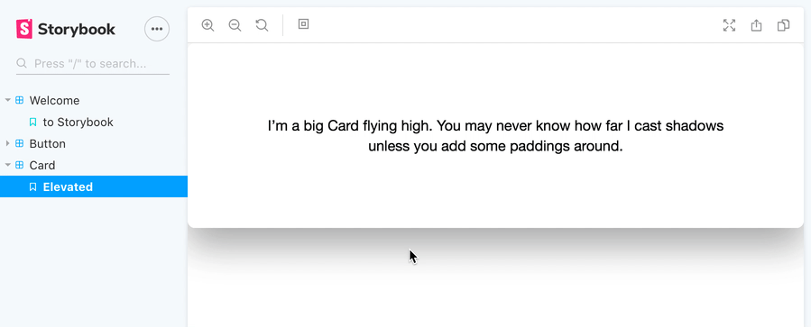

# Storybook Paddings Addon

[](https://www.npmjs.com/package/storybook-addon-paddings)
[](https://github.com/rbardini/storybook-addon-paddings/actions)
[](https://david-dm.org/rbardini/storybook-addon-paddings)
[](https://david-dm.org/rbardini/storybook-addon-paddings?type=dev)

A [Storybook](https://storybook.js.org) addon to add different paddings to your preview. Useful for checking how components behave when surrounded with white space.

[Live demo](https://storybook-addon-paddings.netlify.com)



## Installation

```sh
npm install --save-dev storybook-addon-paddings
```

within `.storybook/main.js`:

```js
module.exports = {
  addons: ['storybook-addon-paddings']
}
```

See [`example`](example) for a minimal working setup.

## Configuration

The addon can configured globally and per story with the `paddings` parameter.

### Global configuration

To add paddings to all stories, call `addParameters` in `.storybook/preview.js`:

```js
import { addParameters } from '@storybook/html'; // or your Storybook framework

addParameters({
  paddings: [
    { name: 'Small', value: '16px' },
    { name: 'Medium', value: '32px', default: true },
    { name: 'Large', value: '64px' },
  ],
});
```

### Per-story configuration

To configure/override paddings for a single story or a set of stories, add the `paddings` parameter:

```js
export default {
  title: 'Stories',
  parameters: {
    paddings: [
      { name: 'Small', value: '16px' },
      { name: 'Medium', value: '32px', default: true },
      { name: 'Large', value: '64px' },
    ],
  },
};

export const myStory = () => '<h1>Hello World</h1>';
myStory.story = {
  parameters: {
    paddings: [
      { name: 'Small', value: '16px' },
      { name: 'Medium', value: '32px', default: true },
      { name: 'Large', value: '64px' },
    ],
  },
};
```

### Disabling the addon

To disable paddings for a story, set the `paddings` parameter to `[]`, or use `{ disable: true }` to skip the addon:

```js
export default {
  title: 'Stories',
  parameters: {
    paddings: [],
  },
};

export const myStory = () => '<h1>Hello World</h1>';
myStory.story = {
  parameters: {
    paddings: { disabled: true },
  },
};
```
